# Event Flow Diagrams

## Chat Message Flow

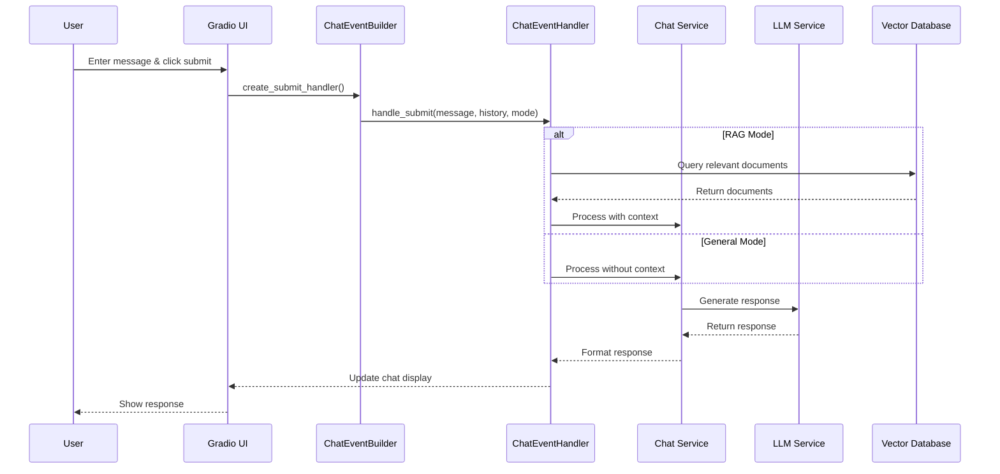

## Document Upload Flow

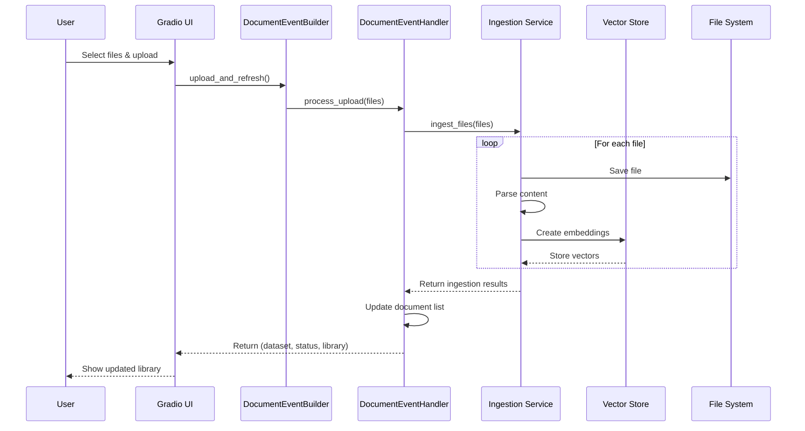

## Settings Update Flow

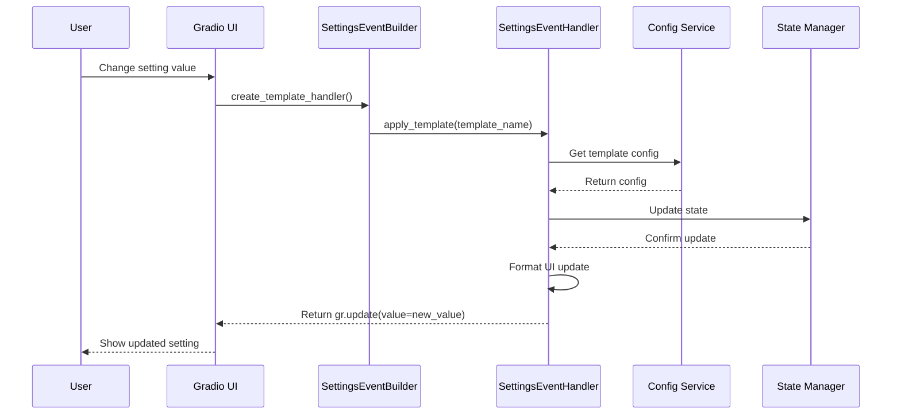

## Feeds Refresh Flow

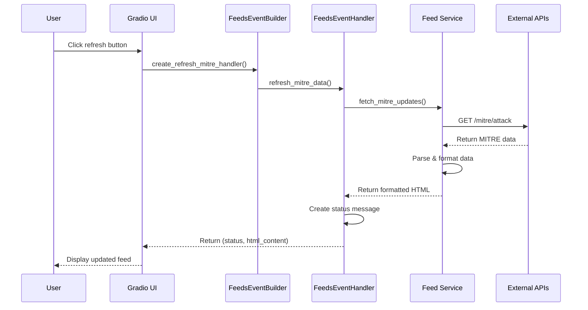

## Error Handling Flow

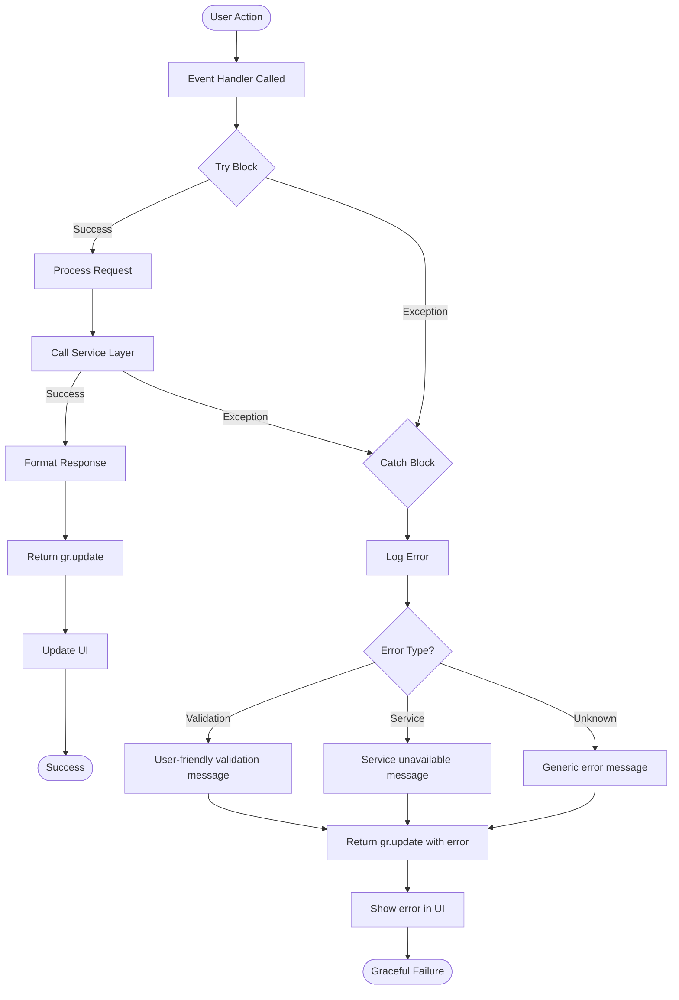

## Component Interaction Overview

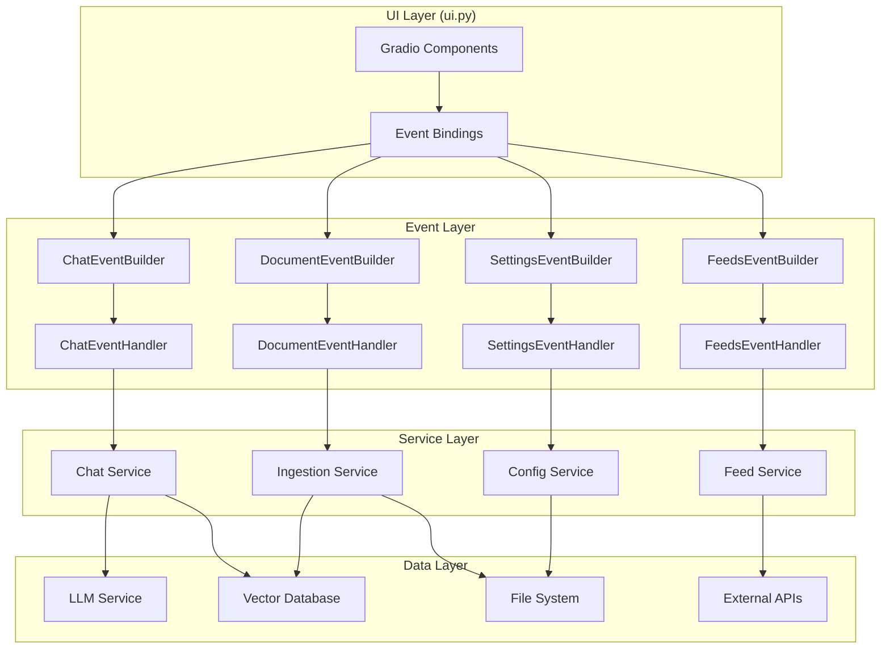

## State Management Flow

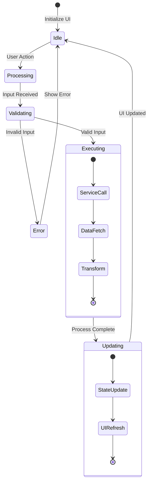

## Event Registration Flow

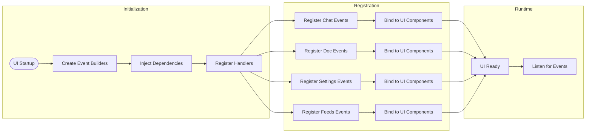

## Async Operation Flow

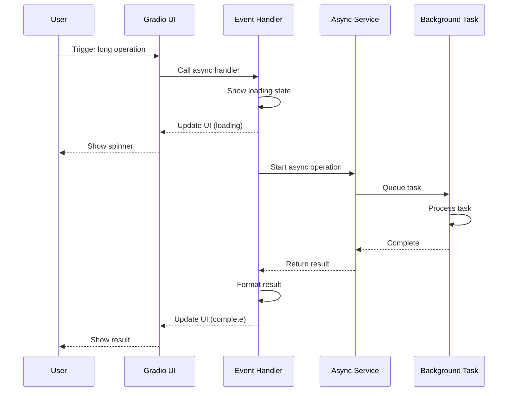

## Event Handler Lifecycle

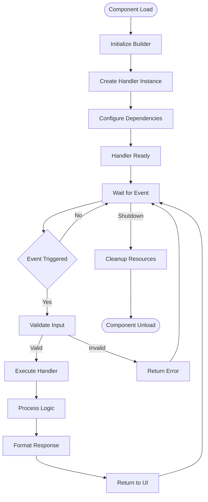

## Testing Flow

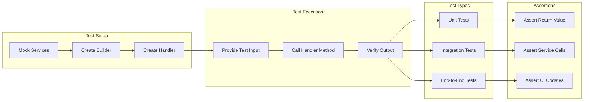

## Key Insights

1. **Separation of Concerns**: Each layer has distinct responsibilities
2. **Unidirectional Data Flow**: Events flow from UI → Handler → Service → Data
3. **Error Boundaries**: Errors handled at each layer to prevent cascading failures
4. **Async Support**: Long operations handled asynchronously
5. **State Management**: Clear state transitions and updates
6. **Testability**: Each component can be tested in isolation

These diagrams illustrate the clean architecture achieved through the event handler refactoring, showing how user interactions flow through the system in a predictable, maintainable way.