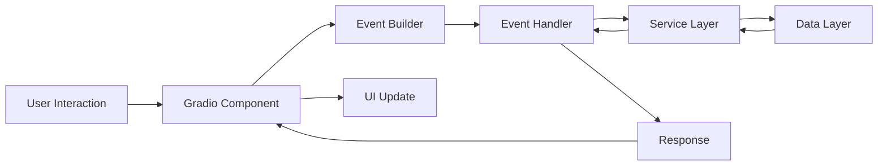

# Event Handler Architecture

## Overview

The Internal Assistant UI follows a clean event-driven architecture that separates UI orchestration from business logic. Event handling is implemented through dedicated event handler modules that process user interactions and update the UI accordingly.

## Core Principles

1. **Separation of Concerns**: UI components (Gradio) are separated from business logic (event handlers)
2. **Direct Binding**: Event handlers are bound directly to UI components without wrapper functions
3. **Modular Design**: Each major UI component has its own event handler module
4. **Dependency Injection**: Event handlers receive services through constructor injection
5. **Error Isolation**: Each event handler includes error boundaries to prevent cascade failures

## Architecture Components

### 1. Event Handler Modules

The system includes four primary event handler modules:

#### ChatEventHandler (`chat_events.py`)
- **Responsibility**: Manages all chat-related interactions
- **Key Handlers**: 5 handlers
  - `create_submit_handler()`: Process chat messages
  - `create_clear_handler()`: Clear chat history  
  - `create_retry_handler()`: Retry last message
  - `create_stop_handler()`: Stop message generation
  - `create_mode_switch_handler()`: Switch between RAG/General modes
  - `create_prompt_handler()`: Update system prompts
  - `create_upload_handler()`: Handle context file uploads

#### DocumentEventHandler (`document_events.py`)
- **Responsibility**: Manages document ingestion and library operations
- **Key Handlers**: 9+ handlers
  - `upload_and_refresh()`: Upload and process documents
  - `show_folder_path_input()`: Enable folder ingestion
  - `ingest_server_folder()`: Process server-side folders
  - `clear_all_documents()`: Remove all documents
  - `refresh_file_list()`: Update document list
  - `handle_search()`: Search documents
  - `handle_filter()`: Filter by document type
  - `handle_filter_with_scroll()`: Filter with UI scrolling
  - `sync_sidebar_with_main()`: Synchronize UI components

#### SettingsEventHandler (`settings_events.py`)
- **Responsibility**: Manages application settings and configurations
- **Key Handlers**: 3+ handlers
  - `create_mode_explanation_handler()`: Update mode descriptions
  - `create_template_handler()`: Apply prompt templates
  - `create_reset_handler()`: Reset to default settings
  - `get_defaults()`: Retrieve default configurations

#### FeedsEventHandler (`feeds_events.py`)
- **Responsibility**: Manages external data feeds and threat intelligence
- **Key Handlers**: 12+ handlers
  - `create_refresh_rss_handler()`: Update RSS feeds
  - `create_refresh_cve_handler()`: Refresh CVE data
  - `create_refresh_mitre_handler()`: Update MITRE ATT&CK data
  - `create_refresh_forum_handler()`: Refresh forum directory
  - Additional handlers for threat intelligence sources

### 2. Event Builders

Event builders provide a factory pattern for creating event handlers with proper dependency injection:

```python
class ChatEventHandlerBuilder:
    def __init__(self, chat_service, context_filter):
        self.chat_service = chat_service
        self.context_filter = context_filter
        self._handler = None
    
    def get_handler(self):
        if not self._handler:
            self._handler = ChatEventHandler(
                self.chat_service,
                self.context_filter
            )
        return self._handler
```

### 3. UI Integration (`ui.py`)

The main UI file orchestrates components and binds event handlers directly:

```python
# Direct binding without wrapper functions
submit_button.click(
    self._chat_event_builder.create_submit_handler(),
    inputs=[message_input, chat_history],
    outputs=[chat_display, message_input]
)
```

## Event Flow



## Error Handling Strategy

Each event handler implements comprehensive error handling:

1. **Try-Catch Blocks**: All handlers wrapped in try-catch
2. **Logging**: Errors logged with context
3. **User Feedback**: User-friendly error messages returned
4. **Graceful Degradation**: Partial failures don't crash the UI
5. **Error Boundaries**: Prevent error propagation

Example pattern:
```python
async def handler(self, *args):
    try:
        # Process request
        result = await self.service.process(*args)
        return gr.update(value=result)
    except ValidationError as e:
        logger.warning(f"Validation error: {e}")
        return gr.update(value=f"Invalid input: {e}")
    except Exception as e:
        logger.error(f"Handler failed: {e}")
        return gr.update(value="An error occurred. Please try again.")
```

## State Management

Event handlers interact with state through:

1. **Gradio State Components**: For UI state
2. **Service Layer State**: For business logic state
3. **Session Management**: For user session data
4. **Context Filters**: For scoped operations

## Testing Strategy

Event handlers are tested at multiple levels:

1. **Unit Tests**: Test individual handlers in isolation
2. **Integration Tests**: Test handler-service interactions
3. **E2E Tests**: Test complete event flows
4. **Error Tests**: Verify error handling paths

## Performance Considerations

1. **Async Operations**: Long-running tasks use async/await
2. **Debouncing**: Rapid events debounced where appropriate
3. **Caching**: Results cached at service layer
4. **Lazy Loading**: Heavy operations deferred until needed

## Security Considerations

1. **Input Validation**: All inputs validated before processing
2. **Sanitization**: User inputs sanitized for security
3. **Authorization**: Operations checked for permissions
4. **Audit Logging**: Security-relevant events logged

## Maintenance Guidelines

1. **Single Responsibility**: Each handler handles one concern
2. **Consistent Patterns**: All handlers follow same structure
3. **Documentation**: All handlers documented with docstrings
4. **Version Control**: Changes tracked with clear commits
5. **Code Reviews**: All changes reviewed before merge

## Future Enhancements

1. **Event Bus**: Implement centralized event bus for cross-component communication
2. **Event Replay**: Add ability to replay events for debugging
3. **Metrics Collection**: Track event handler performance
4. **Dynamic Loading**: Load handlers on demand for better performance
5. **Plugin System**: Allow third-party event handler plugins

## Migration Path

For developers migrating from the monolithic architecture:

1. Identify event handling logic in ui.py
2. Extract to appropriate event handler module
3. Create event builder if needed
4. Replace inline logic with direct handler binding
5. Test thoroughly
6. Document changes

## Conclusion

This event handler architecture provides:
- **Clean separation** between UI and business logic
- **Maintainable code** through modular design
- **Testable components** through isolation
- **Scalable foundation** for future features
- **Robust error handling** for reliability

The architecture has successfully reduced ui.py from 6,357 lines to 1,427 lines (77.5% reduction) while maintaining all functionality.